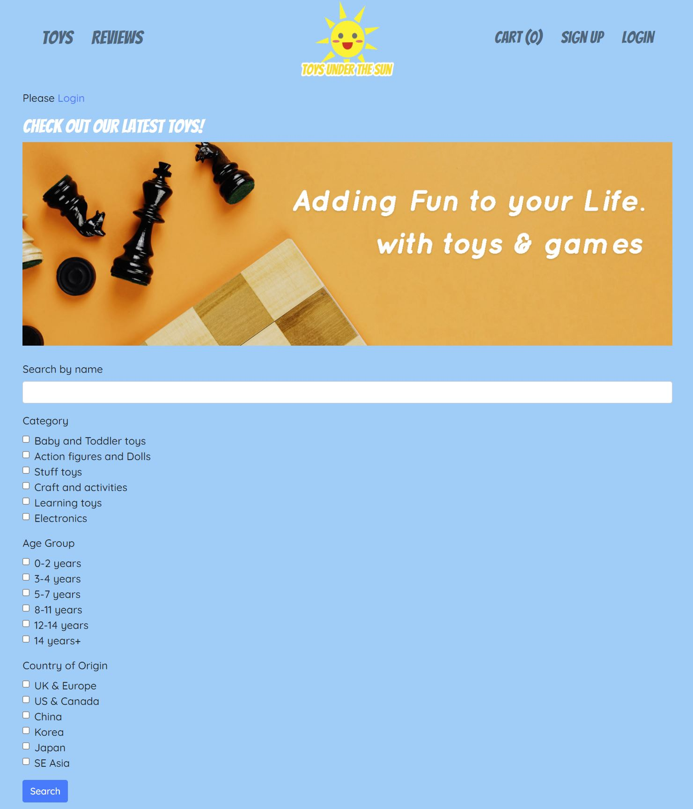
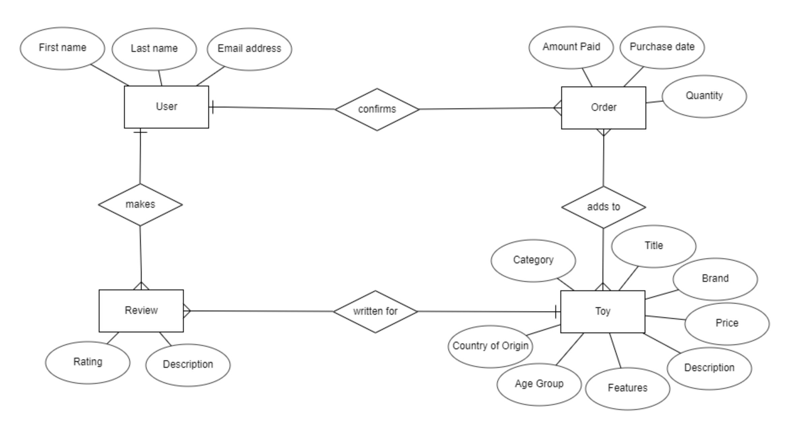

#


# Full Stack Frameworks with Django - Milestone Project: **Toys under the Sun**

[Toys🎮 under the Sun🌞](https://toysunderthesun.herokuapp.com/toy/) is an e-commerce website for users to search, review and purchase toys meant for young kids to teenagers globally. It helps to make the users buying experience easy by letting them read and write reviews of these toys before deciding on the purchase. 

The sample user login:

| _ID:_ **happyuser** | _Password:_ Manytoys123 |
| --- | --- |

The administrator login:

| _ID:_ toys | _Password:_ first |
| --- | --- |




## UX

The web application is meant to be easy to manoeuvre for the user or customer to find toys easily, read reviews to determine if it is the right toy for them, add to shopping cart and purchase them. The customer will need to create a user login to either write a review on a toy or make a purchase!

On the other hand, it should also allow the administrator to add, edit and delete toy products from this online catalog. 

## UI

_Colour_

The main colours used in the site are blue, white, and yellow.

_Font_

Cursive fonts that are more playful like Bangers and Caveat to highlight certain key points.

Sans-serif font, Quicksand, which allows easy reading of chunky text.

_Wireframe_

The [wireframe for the home page can be found here.](https://github.com/Minirazs/project4_toys-under-the-sun/blob/master/static/img/wireframe.JPG) The overall idea is to make the web application user-friendly and intuitive to navigate:

1. Navbar on top with all the links related to the products (Toys) and product reviews on the left, and links related to the user and shopping cart on the right.
2. The middle section of the site will show the advanced search criteria and/ or to display the search results or entries.
3. The footer of the site has links similar to the navbar

## User Stories

Users&#39; goals:

1. To find out about the latest toys using the search form (able to search by name, age group suitable to play, country of origin and category)
2. To read reviews of toys and even write / edit reviews
3. To make purchases of toys

Site owners&#39; goals:

1. Earn income from the sale of toys (ecommerce)
2. Increase brand awareness
3. Track customer information – understand the buyers trends to decide what kind of Toy items to bring in and roll out, and capture more sales
4. Authentication and authorisation
  1. to allow new users to sign up, verify their email address etc.
  2. to track purchase / order history
  3. to add/edit/delete product item and information

## Features

- Navbar links to all pages on the site – Toy (Home page), Review and Cart (Shopping cart to lead to checkout)
- Under the Toy / Homepage and after the user searches based on the criteria, upon clicking on the image or name on the card (search display result), it will lead to the individual Toy product page showing its features, price, country of origin, and reviews given by users that have signed up an account.
- Under the Review tab, it shows all the reviews written by user who has signed in. Only the user who has created the review is able to edit and delete it.
- Toy items can be &#39;purchased&#39; by the user by allowing the user to add, remove items from his shopping cart, view the total amount of the purchase, and proceed to the checkout page to enter his credit card details for successful payment.
- Only the Administrator of the site is able to create, edit and delete Toy details. These features are only seen and made available to the Administrator.
- In the Django Admin panel, the administrator is able to view all the Purchase instances (order history of all the users) to keep track of sales and orders.
- In the Django Admin panel, the administrator has the authority to edit user&#39;s details such as password or verify their email addresses.
- In the Django Admin panel, the administrator can also add, edit and delete the Toy and Review.
- Flash messages – to prompt the user on whether certain actions are successfully or unsuccessfully completed. E.g. edited successfully to Cart or deleted successfully
- Footer consists all the links in navbar for user to quickly navigate around the site.
- Mobile responsive – when device and screen size changes, the elements in the site change to optimize the user&#39;s viewing experience.

### _Features that can be improved / Future Developments_

1. Navbar to have a dropdown that leads the user to different Toy categories without needing to use the search form. To make the search form more concise, taking up less space.
2. Have a **banner carousell** right below the navbar to allow users to read what the site is about, the latest trends and ongoing promotions
3. At Product Creation and Editing page, to **dynamically generate additional input fields** and to have **HTML tags to style** the inputs
4. To **create a User app with User model** – for user to access Purchase/ Order history and to enter Shipping details for ordered items to be shipped to him directly.
5. To have **superuser account creation** by having a Superuser app with Superuser model for some toy retailers to list and manage their items, check sales and order details on the site.
6. To have additional pages in the site to describe the T&C of purchases, after sales services and shipment queries etc.

Currently, only the Administrator is able to view Purchase model and instances of every Purchase (Purchase/Order history) in the admin panel.

1. **To have a User account page** – to update particulars, account details like password and email address, shipping address, check Purchase / Order history
2. **Order confirmation** - To send out an email with the purchase details and collection/shipping details to the user with every successful payment order automatically
3. **Successful login user page** – to have a successful login in page and lead user back to User panel (future feature)

Technologies Used

- HTML5
- CSS3
- JavaScript
- JQuery
- Python
- [Django 3.1.1](https://www.djangoproject.com/)
- [django-allauth](https://django-allauth.readthedocs.io/en/latest/overview.html) for user authentication
- [django-crispy-forms](https://django-crispy-forms.readthedocs.io/en/latest/) for form styling
- [dotenv](https://pypi.org/project/python-dotenv/)
- [PostgreSQL](https://www.postgresql.org/) as the database
- [psycopg2](https://pypi.org/project/psycopg2/)
- [dj-database-url](https://pypi.org/project/dj-database-url/)
- [gunicorn 20.0.4](https://gunicorn.org/)
- [WhiteNoise](http://whitenoise.evans.io/en/stable/)
- [Stripe](https://stripe.com/)
  - To handle checkout and payments using credit cards (test)
- [Cloudinary](https://cloudinary.com/)
  - store images on cloud database
- [Bootstrap 4](https://getbootstrap.com/)
  - The project uses Bootstrap framework for basic, quick, customisable design codes and allows the site to be mobile responsive.
- [Bootstrap NavBar code by Codeply](https://www.codeply.com/go/qhaBrcWp3v)
  - To centralise logo in the middle of the navbar with links on each side
- [Font Awesome v5.0.0](https://fontawesome.com/)
  - Github icon from Font Awesome
- [Am I Responsive?](http://ami.responsivedesign.is/)
  - To check the mobile responsiveness of the site
- [Word to markdown converter](https://word2md.com/)
  - To convert word doc into Markdown for use in README.md
- [Google Font](https://fonts.google.com/)
  - Fonts used
- [Favicon](https://favicon.io/)
  - Favicon creation
- [Github](https://github.com/) and GitPod
- [Heroku](https://www.heroku.com/)

## Programming Methodologies

- .env file stores environment variables so database credentials are hidden from public view.

## Database Design
ER Diagram


## Testing

Before deployment to Heroku, the manual testing is done using the browser&#39;s Inspect tool and 8080 server to preview the site ensures that the site is mobile responsive and all content, such as buttons and links, are linked correctly and displayed on different screen sizes, namely mobile (below 480px), tablet (between 768px to 1024px) and laptop (above 1024px):

- iPad (portrait and landscape mode)
- iPad Pro (portrait and landscape mode)
- Kindle Fire (portrait and landscape mode)
- Galaxy S9/S9+
- iPhone X/XS
- iPhone 6/7/8
- iPhone 5/SE
- Pixel 2
- Moto G4
- Surface Duo
- Galaxy Fold

These steps are repeated in the testing on major web browsers, Chrome and Firefox:

| # | Event | Expected Outcome | Actual Outcome |
| --- | --- | --- | --- |
| 1 | Click on navbar logo at the centre | Links to Homepage | As expected |
| 2 | Click on Toy link on the left of navbar | Links to Toy search page | As expected |
| 3 | Click on Review link on the left of navbar | Links to Review page, showing all reviews | As expected |
| 4 | Click on Cart on the right of navbar | Links to shopping cart page | As expected |
| 5 | Click on Login / Sign Up on the right of navbar | Links to respective user sign up or login page | As expected |
| 6 | Sign up for a new account | Prompt user to enter email, username and password. Checks if it&#39;s existing user. If it&#39;s new user, will be led to Verify Email page | As expected |
| 7 | User forgets login password | User will be brought to Forget password page and enter new password after verification | As expected |
| 8 | Enter search by any or all or a combination of the search criteria | Toys that match the search criteria will be shown.Dummy recipes have been created (have already been deleted) to test that toys are shown correctly based on the criteria | As expected |
| 9 | Admin creates new toy, click on Add New Toy button | Enter toy details in the Create Toy page and submit form. Toy is created and stored in database. | As expected |
| 10 | Admin edits toy, click on Edit button | Edit toy details in the Update Toy page and submit form. Toy details are updated and stored in database. | As expected |
| 11 | Admin deletes toy, click on Delete button and &#39;Yes&#39; to confirm on next page | Toy is deleted from the database | As expected |
| 12 | Upload Image by selecting 1 file from Local drive at Create Toy / Update Toy pages | Selected Image upload successfully to Cloudinary. | As expected for New Toy created. Update Toy page has some issues, explained below |
| 13 | User creates new review | Enter review details in the Create Review page and submit form. New review is created and stored in database. | As expected |
| 14 | User edits review, click on Edit button | Edit review details in the form. Submitted, updated and stored in database. Only the user that created the review has authority to edit it. | As expected |
| 15 | User deletes review, click on Delete button and &#39;Yes&#39; to confirm on next page | Delete review details in the form. Review deleted from database. Only the user that created the review has authority to delete it. | As expected |
| 16 | On the delete Toy page, to click on _No_ button to abort deletion | Will link back to Home Page if the Admin cancels deletion | As expected |
| 17 | On the delete Review page, to click on _No_ button to abort deletion | Will link back to Home Page if the user cancels deletion | As expected |
| 18 | Add item to Cart | Item added to cart. Shown on navbar and on Cart page. | As expected |
| 19 | Edit the quantity of product in Shopping Cart | Type in the new quantity, click on update quantity button to save the new quantity | As expected |
| 20 | Tally the total amount payable in cart | View subtotal of each product in cart and the grand total of all the products in the cart before checkout | As expected |
| 21 | Checkout using test credit card details | Successful credit card payment processed. Toast message to say &quot;Checkout successful&quot; and user is brought back to home page. Correct amount is credited to Stripe account as sales. Also, webhook is successful with stripe sending metadata back. | As expected |
| 22 | Save the Purchase instances and store it in database upon successful checkout | Purchase instances of every Toy purchased are saved and stored in database upon successful checkout with the correct Toy ID, quantity, amount and date/time ordered | As expected |
| 23 | Create a new user login account | Email verification sent to user&#39;s email. User to click on the link to verify account for successful creation. | Did not receive email. User can only be verified at Admin panel (explained below) |

_Potential issues or limitations with Product text inputs_

For the text inputs such as description of the toy, product features and review writing, the verification or validation of whether the content typed is correct or no typo errors will be on the Administrator.

A few ways to present the text inputs properly and beautifully will be to allow the Administrator to type in HTML tags in the textarea so that the content can be displayed well. A future feature to be added.

_Issues with User email verification_

**User email verification can only be done at the Django Admin panel, manually clicked verified by the Administrator.** When the user email link was presented in the Gitpod terminal (local server) and clicked to open, no page was found to verify the email.

Also, when app is deployed to Django, the user signing up for a new account. The site says verification email is sent to the user&#39;s email. However, there is no actual email sent despite multiple attempts. In the Django Admin panel under Users, this new user has been registered.


_Issues with Product Editing page and Cloudinary image uploader_

When the administrator edits a Toy item, the Cloudinary image uploader has some issues, causing the form to need to submit twice before the Toy item is successfully updated. Secondly, in the Update Toy page, it is compulsory for an image to be uploaded before it can be submitted even though the existing image URL is still present.

Secondly, as a future development, when the Toy already has an existing image uploaded, the image URL can be stored separately and input so as not needing a new image to be uploaded again.

##


## Deployment

Code for the project was committed to GitHub:

Github is used for version controlling and all the commits for this project found at this link:

[https://github.com/Minirazs/project4\_toys-under-the-sun](https://github.com/Minirazs/project4_toys-under-the-sun)

The site is automatically updated when new commits are pushed to the master branch from VSC or GitPod using the Source Control: Git panel on the left of the console.

1. Once there are any changes made to the files, individual files are staged by clicking on the &#39;+&#39; sign in the Source Control: Git panel
2. Enter relevant message to the changes into the bar and press Ctrl Enter to commit to GitHub

OR 
1. Add individual file to the next commit staging area by typing in the bash terminal: ```git add <filename>```
2. Add changes in the working directory: ```git add .``` 
3. Write a meaningful message to describe the changes: ```git commit -m "<message>"``` 
4. Push initial local branch commits to the remote repository master branch: ```git push -u origin master```
5. Push subsequent local branch commits: ```git push```

**Deployment to Heroku via GitPod:**

1. Log into Heroku by typing into the bash terminal: ```heroku login -i```
2. Create a new heroku app: ```heroku create <app-name>```
3. Check correct remotes added: ```git remote -v```
4. Install gunicorn: ```pip3 install gunicorn```
5. Create a name file named &quot; **P** rocfile&quot; in the same directory as app.py
6. Enter: ```web gunicorn <python file name without '.py'>```
7. Create requirements file: ```pip3 freeze --local requirements.txt```
8. Using bash, commit all new changes to GitHub: ```git add .``` then ```git commit -m "message"```, and then git push to Origin ```git push```
9. Push to Heroku: ```git push heroku master```

On Heroku website:

- Log into [Heroku](https://id.heroku.com/login) dashboard, go to Settings and Config Vars to set environment variables (same as those named in .env file) under Config variables
```
SECRET_KEY = "<Your own key>"
CLOUDINARY_CLOUD_NAME = "<Cloudinary account name>"
CLOUDINARY_API_KEY = "<Cloudinary API key>"
CLOUDINARY_API_SECRET = "<Cloudinary secret key>"
STRIPE_PUBLISHABLE_KEY = "<Stripe publishable key>"
STRIPE_SECRET_KEY = "<Stripe secret key>"
ENDPOINT_SECRET = "<Stripe webhook endpoint signing secret>"
DATABASE_URL = "<Heroku PostgreSQL database URL>"
EMAIL_HOST_PASSWORD = "<email host password>"
EMAIL_HOST_USER = "<email address>"
TEST_EMAIL = "0"

```
- Open App to view the web application!

**Clone repository and run the application locally on Windows**

1. Install the Heroku Command Line Interface (CLI) for Windows installation here: https://devcenter.heroku.com/articles/getting-started-with-python#set-up
2. On Windows, start the Command Prompt (cmd.exe) and log into Heroku: ```heroku login -i```
3. Clone repository to have a local version of the code: ```git clone https://github.com/Minirazs/project4_toys-under-the-sun.git```
4. Change directory to local repository: ```cd project4_toys-under-the-sun```
5. Create a new heroku app: ```heroku create <APP NAME>```
6. If the app is already created, add heroku remote: ```heroku git:remote -a <APP NAME>```
7. Deploy to Heroku: ```git push heroku main```
8. Open the app: ```heroku open```
9. Install app dependencies locally: ```pip install -r requirements.txt```
10. In root folder, create a .env file and set the following environment variables:
```
export SECRET_KEY = "<Your own key>"
export CLOUDINARY_CLOUD_NAME = "<Cloudinary account name>"
export CLOUDINARY_API_KEY = "<Cloudinary API key>"
export CLOUDINARY_API_SECRET = "<Cloudinary secret key>"
export STRIPE_PUBLISHABLE_KEY = "<Stripe publishable key>"
export STRIPE_SECRET_KEY = "<Stripe secret key>"
export ENDPOINT_SECRET = "<Stripe webhook endpoint signing secret>"
export DATABASE_URL = "<Heroku PostgreSQL database URL>"
export EMAIL_HOST_PASSWORD = "<email host password>"
export EMAIL_HOST_USER = "<email address>"
export TEST_EMAIL = "0"

```
10. Run collectstatic: ```python manage.py collectstatic``` and reply "yes"
11. Start the app locally using heroku local: ```heroku local web -f Procfile.windows```
12. Open http://localhost:5000 with web browser and the app is running locally!


## Credits 

_Tools &amp; Tech used_

Special thanks to the developers and tech creators for sharing freely their code and tools that are used in this site creation. 🤗🙌 They are listed in the Technologies section above.

_Certain Django &amp; Heroku Deployment steps_

Special thanks and credit to [Heroku Dev Center](https://devcenter.heroku.com/articles/getting-started-with-python) and my Coding Instructor [Paul Chor](https://github.com/kunxin-chor) for providing the Django code to some parts of the website (including cart and checkout) and the deployment steps that are shown above.

_Images, Content &amp; Logo 📷_

- All product content including description, images and prices etc. are taken from [Toy&#39;r&#39;us.com](https://www.toysrus.com.sg/) and copyrights belong to every toy&#39;s respective brand

_This e-commerce website is created for educational purposes only._